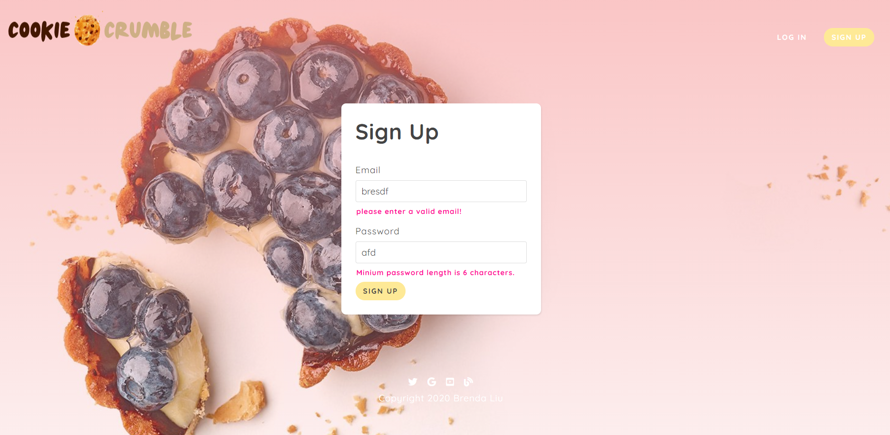
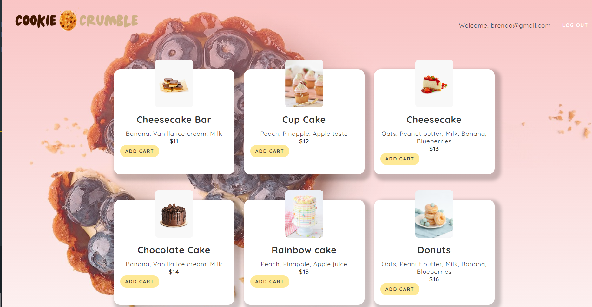
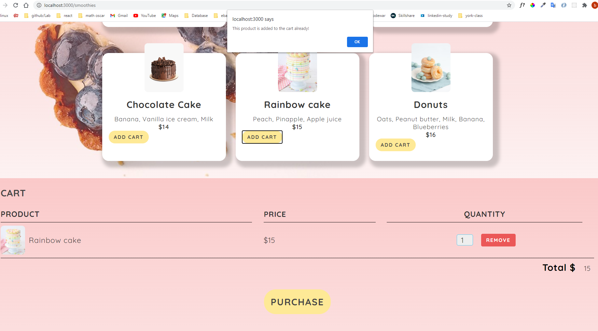
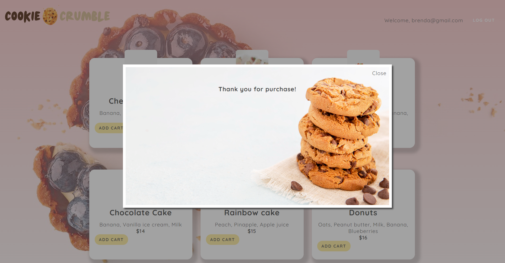

### npm start and listen port 3000

mongodb, JWT, login/ logout system
shijing Liu 2020-11-5

/signup get signup page
/login get login page

/signup post create a new user in DB

-- hash password in Schema.pre and save user and password to DB.
-- Instantly log the user in ( create a jwt for them).

/login post authenticate a current user
-- after login, create a jwt for them.

-- If user cannot login or register successfully, he cannot go to smoothies page to check smoothies list. (router was protected by auth Middleware of jwt)

/logout get log a user out

